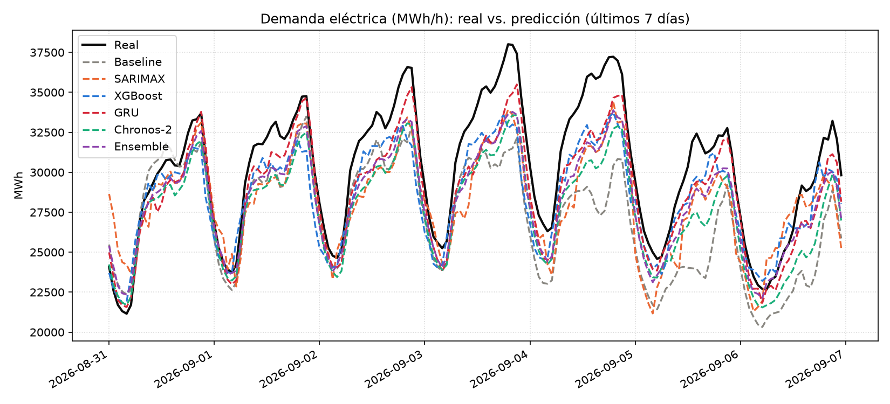
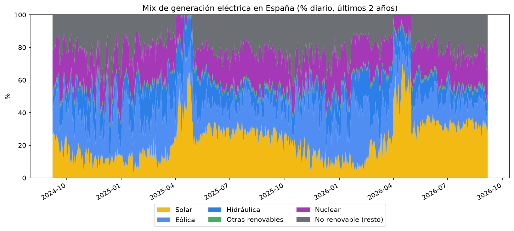
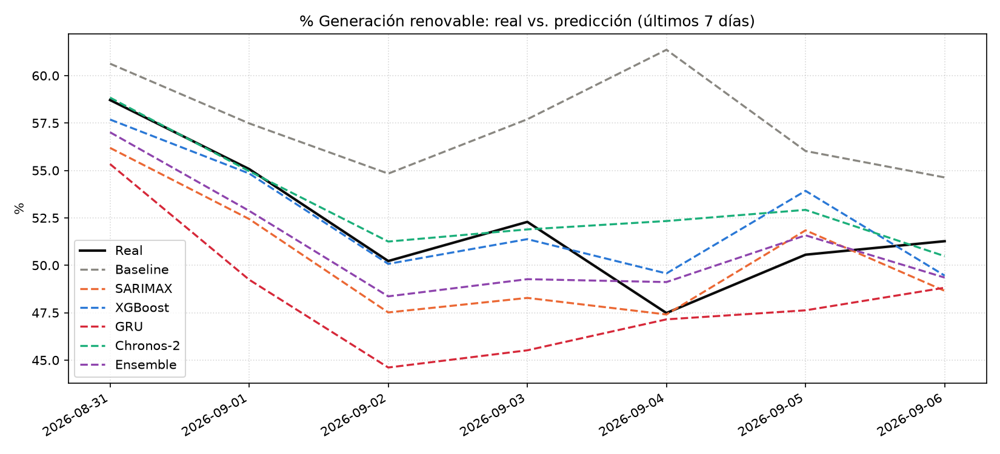

# Demanda eléctrica y % renovable en España -- forecasting a 7 días

Predicción a 7 días de (1) la demanda eléctrica horaria de España y (2) el % de generación
renovable diario, usando datos 100% reales y públicos: [REE (Red Eléctrica de
España)](https://www.ree.es/) para demanda y mix de generación real, y
[Open-Meteo](https://open-meteo.com/) para clima (radiación solar, viento, oleaje...). Se
comparan varios enfoques de forecasting de complejidad creciente -- desde un baseline ingenuo
hasta [Chronos-2](https://github.com/amazon-science/chronos-forecasting), el *foundation
model* de series temporales de Amazon -- y la app final usa, para cada objetivo, el que de
verdad funciona mejor, en vez de forzar un único modelo para todo.

## Por qué este proyecto

No es un ejercicio de "voy a usar un dataset random para practicar". Mi grado (Business
Analytics) está pensado para formar un perfil híbrido entre negocio, ingeniería de datos y
estadística, y este proyecto es un paso deliberado hacia Data Science: entender de verdad
por qué se elige cada modelo, medir honestamente cuándo funciona y cuándo no, y dejarlo
documentado de forma que pueda defenderlo en una entrevista, no solo enseñarlo.

## Fuentes de datos

- **REE apidatos** -- demanda eléctrica horaria (`/demanda/evolucion`) y mix de generación
  real por tecnología (`/generacion/estructura-generacion`): Solar fotovoltaica, Solar
  térmica, Eólica, Hidráulica, Nuclear, Ciclo combinado, Carbón, Cogeneración y el resto de
  tecnologías del sistema peninsular, día a día. De ahí sale el **% renovable real
  histórico** (no una estimación a partir del clima -- el clima es la variable predictiva,
  la generación real de REE es la verdad de entrenamiento y evaluación) y el desglose
  completo del mix, que alimenta la gráfica de generación tipo *stacked-area*.
- **Open-Meteo** -- radiación solar (media y máxima diaria, directa y global), nubosidad,
  viento a 10m y a 100m (la altura real de buje de un aerogenerador moderno, con media y
  máxima diaria), precipitación, temperatura, humedad y presión. Todo gratis, sin API key.
- **Open-Meteo Marine** -- oleaje cerca de Mutriku (País Vasco), la única planta undimotriz
  real de España. Se prueba como variable exploratoria: como esa tecnología es casi
  anecdótica en el mix nacional, se esperaba (y se confirma en la importancia de variables)
  que aporte poca señal frente a sol y viento -- se reporta el resultado real, no solo el que
  "queda mejor".
- **Viento en las 3 regiones eólicas de verdad** (Aragón, Castilla y León, Galicia), no en
  Madrid -- Madrid no es zona eólica, y medir ahí el viento para explicar la generación
  eólica nacional era medir en el sitio equivocado. Se usa la media, el máximo y la
  desviación entre las tres regiones, más `wind_power_proxy` (viento medio al cubo, capado a
  12 m/s): la potencia de un aerogenerador escala aproximadamente con el cubo de la
  velocidad del viento, no linealmente, así que dar esa variable ya calculada le ahorra al
  modelo tener que reconstruir la curva a base de cortes.
- **Ciclo anual (seno/coseno del día del año)** -- con varios años de histórico ya hay ciclos
  anuales completos de sobra para que el modelo aprenda que el % solar depende sobre todo de
  la época del año, una señal mucho más estable que la meteorología día a día.
- **Clima de 5 áreas metropolitanas ponderado por población** (Madrid, Barcelona, Valencia,
  Sevilla, Bilbao) para demanda -- mismo razonamiento que con el viento: la demanda nacional
  depende de dónde vive la gente de verdad, no de un único punto. De ahí se derivan
  **HDD/CDD** (grados-día de calefacción/refrigeración, `max(0,18-T)` / `max(0,T-18)`), el
  estándar del sector para demanda sensible al clima, que capturan el doble pico anual de
  España (verano por AC, invierno por calefacción) mejor que la temperatura en bruto.
- **Precio spot horario** (REE, endpoint de mercados) -- usado solo como *lag* (precio de
  ayer, de hace una semana), nunca como "precio futuro conocido": en producción el precio de
  mañana en adelante no se conoce con certeza más allá de un día.
- **Festivos regionales ponderados por población** -- una fiesta en La Rioja (0.6% de la
  población) no pesa igual que una en Andalucía o Cataluña (16-18%).
- **Lluvia acumulada de 30/90 días** (derivada de la precipitación de Open-Meteo, coste cero)
  -- para % renovable. La hidráulica no depende de si llovió ayer, sino de cuánta agua se ha
  ido acumulando en los embalses durante meses; la precipitación de un solo día no captura eso.
- **Demanda diaria como covariable del % renovable** -- por el orden de mérito del mercado
  eléctrico: las renovables entran siempre primero (coste marginal ~0), así que un día de
  mucha demanda no añade más renovable, añade más térmica de respaldo por encima, diluyendo
  el % aunque la generación renovable en bruto sea la misma. Mismo dataset que ya trae la
  demanda, coste cero también.

## Los datos: 10 años, no 5

Se amplió el histórico de 5 a 10 años para dar más ejemplos a los modelos entrenados desde
cero (especialmente el GRU). Aviso honesto: para % renovable esto mete años con mucha menos
solar/eólica instalada que ahora (el mix cambió mucho desde 2016) -- se probó igualmente
porque la ganancia de más datos para XGBoost/GRU compensaba, y de hecho el rendimiento se
mantuvo o mejoró.

### Bugs reales, encontrados y corregidos

- **Escala rota en la API de REE.** Al construir la gráfica de mix de generación por
  tecnología, la suma de los campos `percentage` de las 13 tecnologías (sin la fila-resumen
  "Generación total") daba **exactamente 0.5000000** en vez de 1.0 -- verificado contra la
  suma de los `value` en MWh de esas mismas tecnologías, que sí coincide exactamente con el
  total. El campo `percentage` que expone la API para este endpoint viene escalado
  sistemáticamente a la mitad (no hay documentación pública que lo explique). Sin este
  hallazgo, el % renovable habría salido siempre a la mitad de su valor real (un 46% real se
  calculaba como ~23%). Ahora el % de cada tecnología se calcula a mano como
  `value_tecnología / value_total_del_día`, ignorando el campo `percentage` de la API.
- **El último día descargado casi nunca está completo.** `data.py` pedía datos hasta "ayer",
  pero REE no siempre tiene el día anterior publicado del todo -- se detectó un día con
  **1 sola hora** de demanda publicada de 24, que se colaba en el holdout de evaluación como
  si fuera un día real y parecía un desplome brutal del % renovable que ningún modelo
  acertaba. `data.py` ahora recorta del final los días con menos de 20 horas reales antes de
  guardar el dataset (`trim_incomplete_trailing_days`).
- **Open-Meteo devuelve el viento en km/h, no en m/s.** Sin pedirlo explícitamente, `wind_power_proxy`
  (pensado en m/s, con el corte físico a 12) capaba casi todos los valores porque en km/h
  casi todo supera 12 -- la variable salía prácticamente constante. Se corrigió pidiendo
  `wind_speed_unit=ms` a la API.
- **La validación de Chronos-2 rechazaba la predicción en vivo.** En la evaluación offline el
  histórico y el futuro son contiguos (se trocea la misma serie), pero en producción casi
  nunca: el histórico real termina 1-2 días antes de "hoy" (por el mismo motivo del punto
  anterior) mientras que la previsión de clima empieza "hoy". Chronos-2 valida por defecto
  que no haya hueco entre ambos y lo rechazaba (`validate_inputs=False` para desactivarlo,
  documentado como una discontinuidad real y esperada, no un error).
- **NaN de arranque envenenaban los pesos del GRU en producción.** `precio_lag_168` no existe
  hasta la hora 168 del histórico (es un `.shift()`) -- en `train.py` esos NaN ya se filtraban
  antes de entrenar cualquier modelo, pero en la predicción en vivo llegaban sin filtrar.
  Un único NaN en un tensor de PyTorch contamina todo el forward/backward, y basta con que
  caiga en un origen de entrenamiento para que **todos** los pesos del modelo acaben en NaN
  para siempre -- la predicción salía en 0 GWh de demanda sin ningún error visible (la suma
  de una serie de puros NaN da 0 con `pandas.sum()`, no NaN). Se corrigió filtrando dentro de
  la propia función que construye las secuencias de entrenamiento, no confiando en que quien
  llame ya haya limpiado los datos.
- **Un hueco de ~77 días en el oleaje histórico rompía SARIMAX -- y llevaba recortando el
  histórico de renovables a la mitad sin que se notase.** Al ampliar a 10 años, Open-Meteo
  Marine no cubre toda esa ventana (solo ~5 años hacia atrás). SARIMAX para renovables entrena
  con todo el histórico sin ventana, así que ese hueco rompía el ajuste (`exog contains inf or
  nans`). Pero el efecto real era peor: el `dropna` que limpia cualquier NaN antes de entrenar
  estaba descartando **todos** los días anteriores al hueco, así que el resto de modelos
  (XGBoost, GRU, Chronos-2) llevaban entrenando en secreto con solo ~5 años, no los 10
  pretendidos. Como el oleaje ya se sabía poco relevante (importancia de variable siempre
  baja), se retiró del modelado en vez de parchear el hueco -- y el histórico de renovables
  pasó de golpe de 1.802 a 3.650 puntos reales.
- **Ajustar el GRU con Optuna lo empeoró, no lo mejoró.** El GRU siempre había usado
  hidden_size/épocas/learning rate fijos, sin buscar -- se añadió una búsqueda con Optuna
  (igual que ya tenía XGBoost) esperando mejorarlo. Con el presupuesto de pruebas que el
  tiempo de cómputo permitía (4 por objetivo, cada una entrena una red desde cero), el
  resultado fue peor: el MAPE de demanda pasó de 3.27% a **4.79%** -- la búsqueda, a ciegas y
  con tan pocas pruebas, no daba con nada mejor que los valores manuales que ya funcionaban,
  y el nuevo dropout probado tampoco ayudaba en una serie con señal fuerte como la demanda.
  Arreglado añadiendo los valores por defecto de siempre como una prueba más
  (`study.enqueue_trial(...)`) -- así Optuna nunca puede devolver algo peor que eso, en el
  peor caso empata. Con el arreglo, demanda quedó en 3.76% (variación normal de semilla
  aleatoria frente al 3.27% original, no un empeoramiento) y renovable en 6.15% (mejor que el
  7.39% roto, aunque sin superar el 3.69% original -- ese modelo en concreto no gana de
  todos modos, ver Resultados).

## Rendimiento: de reentrenar en cada click a servir pesos ya entrenados

"Predicción en tiempo real" reentrenaba XGBoost y el GRU desde cero en cada click -- al
añadir la reconstrucción retrospectiva de los últimos días y el desglose por tecnología, un
solo click llegó a reentrenar 3-4 GRU y varios XGBoost seguidos, suficiente para disparar el
*throttling* de CPU de Streamlit Community Cloud. No hacía falta: los hiperparámetros ya
estaban validados por `train.py`, solo hacía falta cargar los pesos y hacer un *forward pass*.

`train.py` ahora guarda los modelos entrenados a disco (`outputs/models/`) y `predict.py` los
carga en vez de reentrenar, con reintento a entrenamiento en vivo si el fichero no existe o
no coincide con las variables actuales. Medido: la predicción completa (demanda +
retrospectivo de 7 días + % renovable + desglose por tecnología + intervalos) pasó de 1-3
minutos a **26 segundos**. De paso, ninguno de los dos campeones actuales usa Chronos-2, así
que ni siquiera hace falta cargar el *foundation model*.

## Los modelos

1. **Baseline estacional** -- el mismo valor que hace una semana. La referencia mínima que
   cualquier modelo tiene que superar.
2. **SARIMAX** (`statsmodels` vía `pmdarima`) -- método estadístico clásico, con clima y
   calendario como variables exógenas.
3. **XGBoost -- forecasting DIRECTO, no recursivo.** Un único modelo predice cualquier paso
   `h` del horizonte a partir de lags/medias móviles calculados siempre con datos reales
   (nunca encadenando sus propias predicciones) más el clima del instante futuro y `h` como
   *feature* explícita. Hiperparámetros ajustados con **Optuna**. La primera versión era
   recursiva (una predicción a 1 paso realimentada paso a paso) y se aplanaba con el
   horizonte -- se explica más abajo por qué se cambió y qué mejoró.
4. **GRU directo multi-horizonte** (PyTorch) -- el clásico de deep learning que faltaba en la
   comparativa. Un encoder GRU procesa la ventana de histórico reciente (14 días para
   demanda, 60 para renovables), su último estado oculto se combina con un resumen del clima
   futuro conocido, y una capa densa produce las predicciones del horizonte completo de una
   sola vez -- directo, no recursivo, mismo motivo que XGBoost. Con ~1.800-3.650 puntos en
   renovables era dudoso que una red entrenada desde cero tuviera suficientes ejemplos para
   no sobreajustar frente a SARIMAX o Chronos-2 zero-shot -- en demanda (87K puntos horarios)
   tenía muchas más opciones. Hiperparámetros (tamaño oculto, dropout, learning rate, épocas)
   ajustados con Optuna, igual que XGBoost.
5. **Chronos-2** (Amazon) -- *foundation model* de series temporales pre-entrenado.
   Funciona en modo **zero-shot**: no se reentrena con estos datos, solo se le da el
   histórico reciente como contexto y el clima previsto como covariable adicional. Que
   compita sin haber visto nunca electricidad española, sin reentrenar nada, es un resultado
   interesante en sí mismo -- gane o no gane en cada objetivo concreto.
6. **Ensemble** -- media simple de los modelos anteriores. Promediar modelos con
   errores no perfectamente correlacionados suele reducir el error total; se reporta como
   uno más y solo "gana" si de verdad mejora sobre los demás.

Todos se evalúan sobre el mismo **holdout temporal** (los últimos 7 días, nunca un split
aleatorio -- mezclar fechas al azar en series temporales dejaría que el modelo "viera" datos
posteriores al punto que se le pide predecir).

### Por qué XGBoost pasó de recursivo a directo

La primera versión encadenaba: predice el paso 1, usa esa predicción como "lag" del paso 2,
y así hasta el paso 168 (o 7). Con horizontes largos eso tiene un problema conocido: en
cuanto el modelo predice un valor cercano a la media, ese valor (ya suavizado) pasa a ser el
lag de entrada del siguiente paso -- y se va aplanando solo. Se notó al mirar la gráfica de
% renovable: la predicción apenas se movía día a día mientras el real oscilaba mucho más, y
la importancia de variables lo confirmaba -- `lag_1` (el valor de ayer) acaparaba el **60%**
de la importancia, todo el clima junto no llegaba al 15%. Ahora, con un modelo directo por
horizonte, `lag_1` baja a un 3-4% y el modelo se apoya en las medias móviles reales y en el
ciclo anual -- justo lo que se quería. El MAPE de % renovable con XGBoost bajó de 18.6% a
**5.3%** solo con este cambio (sobre datos ya corregidos).

## Resultados

*(10 años de histórico -- ~87.400 puntos horarios de demanda, 3.650 días de % renovable --
holdout = últimos 7 días, nunca aleatorio)*

### Demanda eléctrica (MWh/h, horizonte 7 días)

| Modelo | MAE | RMSE | MAPE % | sMAPE % | R² | Mejora vs. baseline |
|---|---|---|---|---|---|---|
| Baseline | 3211.3 | 3811.4 | 10.37 | 11.14 | 0.15 | -- |
| **GRU (PyTorch, directo) -- campeón** | 1181.3 | 1451.4 | **3.76** | 3.85 | 0.88 | **+63.7%** |
| XGBoost (directo, Optuna) | 1852.6 | 2225.8 | 5.85 | 6.07 | 0.71 | +43.6% |
| Ensemble (SARIMAX+XGBoost+GRU+Chronos-2) | 1917.4 | 2202.9 | 6.08 | 6.30 | 0.72 | +41.4% |
| SARIMAX | 2480.9 | 2836.9 | 8.10 | 8.43 | 0.53 | +21.9% |
| Chronos-2 (zero-shot + covariables) | 2527.5 | 2851.6 | 8.05 | 8.46 | 0.53 | +22.4% |

El GRU entrenado desde cero gana con margen claro sobre el resto (R²=0.88). SARIMAX, en
cambio, empeoró al doblar el número de variables exógenas (de 7 a 14) sin ampliar su ventana
fija de entrenamiento (120 días) -- sobreajuste/multicolinealidad en los coeficientes
exógenos que los árboles y la red manejan mejor gracias a la regularización.

### % Generación renovable (horizonte 7 días)

| Modelo | MAE | RMSE | MAPE % | sMAPE % | R² | Mejora vs. baseline |
|---|---|---|---|---|---|---|
| Baseline | 5.29 | 6.48 | 10.54 | 9.74 | -2.65 | -- |
| **XGBoost (directo, Optuna) -- campeón** | 1.37 | 1.73 | **2.69** | 2.66 | 0.74 | **+74.5%** |
| Chronos-2 (zero-shot + covariables) | 1.38 | 2.10 | 2.81 | 2.72 | 0.62 | +73.3% |
| XGBoost (descompuesto por tecnología) | 1.58 | 2.01 | 3.08 | 3.13 | 0.65 | +70.8% |
| Ensemble (SARIMAX+XGBoost+GRU+Chronos-2) | 1.98 | 2.03 | 3.81 | 3.83 | 0.64 | +63.9% |
| SARIMAX | 2.26 | 2.54 | 4.28 | 4.39 | 0.44 | +59.4% |
| GRU (PyTorch, directo) | 3.25 | 3.66 | 6.15 | 6.37 | -0.17 | +41.7% |

XGBoost pasa a campeón tras añadir lluvia acumulada (30/90 días) y demanda diaria como
covariable -- Chronos-2, que recibe las mismas variables nuevas, también mejora (era 3.52%
antes); SARIMAX en cambio empeora (3.82% antes → 4.28%), probablemente por colinealidad entre
las dos variables de lluvia acumulada en su ajuste lineal. El backtest de abajo matiza este
campeonato: sobre varias ventanas, Chronos-2 es más consistente que XGBoost.

### Un experimento honesto que no gana: descomponer por tecnología

Hipótesis: solar, eólica e hidráulica tienen dinámicas muy distintas (solar casi
determinista por el ciclo anual, eólica errática, hidráulica lenta), así que predecir cada
una por separado y sumarlas debería ganarle al modelo sobre el agregado. Sigue sin ganar
(3.08% frente al 2.69% de XGBoost agregado) -- se documenta igual, gane o no.

## Backtesting: por qué un solo holdout no basta

Un único holdout de 7 días es una sola muestra: si esa semana en concreto fue rara, el MAPE
que sale puede ser optimista o pesimista solo por suerte. El backtest evalúa varias ventanas
de 7 días consecutivas al final de la serie, cada una con su propio entrenamiento expansivo
(todo lo anterior a esa ventana) -- 3 ventanas en demanda, 5 en renovable (menos que lo ideal
por coste de cómputo, ver limitaciones). SARIMAX y XGBoost reutilizan en cada ventana el
orden/hiperparámetros ya validados en el holdout único; el GRU sí reentrena y recalcula su
normalización por ventana, porque esas estadísticas dependen de los datos de esa ventana en
concreto.

### Demanda (3 ventanas)

| Modelo | MAPE % (media) | MAPE % (desv.) |
|---|---|---|
| **GRU** | **3.55** | 0.79 |
| Ensemble | 3.96 | 2.03 |
| Chronos-2 | 4.20 | 3.34 |
| XGBoost | 4.69 | 1.03 |
| SARIMAX | 6.98 | 1.28 |
| Baseline | 6.97 | 2.99 |

El GRU gana también aquí, y de forma consistente en las tres ventanas -- coincide con el
campeón del holdout único.

### % Renovable (5 ventanas)

| Modelo | MAPE % (media) | MAPE % (desv.) |
|---|---|---|
| **Chronos-2** | **2.22** | 0.71 |
| Ensemble | 2.74 | 0.63 |
| SARIMAX | 2.86 | 0.79 |
| XGBoost | 3.64 | 1.07 |
| GRU | 3.81 | 1.72 |
| Baseline | 6.01 | 2.74 |

Aquí el backtest **no coincide** con el campeón del holdout único: XGBoost gana la última
semana (2.69%), pero Chronos-2 es el más consistente a lo largo de 5 ventanas independientes
(2.22% de media, la desviación más baja de todas). Es la razón de ser de este backtest --
un solo holdout puede llevar a una conclusión distinta de la que sale con más ventanas. La
selección de modelo en producción sigue el holdout único (`predict.py` no cambia de criterio
por esto), pero queda documentado como el hallazgo honesto que es.

## Intervalos de predicción (P10-P90)

Además del valor puntual, se calcula un intervalo de predicción a partir de los residuos
(real - predicho) del propio backtest, agrupados por día del horizonte (o por paso, en %
renovable) y tomando los percentiles 10 y 90 -- mismo método para todos los modelos. La
cobertura real (¿el intervalo nominal del 80% cubre de verdad el 80% de las observaciones?)
se mide sin circularidad: el intervalo de cada ventana se calcula solo con las demás
ventanas (*leave-one-fold-out*).

| Objetivo | Cobertura real del campeón |
|---|---|
| Demanda (GRU) | 56.9% |
| % Renovable (XGBoost) | 54.3% |

Ambas quedan claramente por debajo del 80% nominal -- los intervalos salen más estrechos de
lo que deberían. Con solo 3-5 ventanas de backtest, los percentiles 10/90 se calculan sobre
muy pocas muestras y no son una estimación fiable de un intervalo al 80% real. Se reporta tal
cual sale, sin ajustar el método para que cuadre con el número esperado.





## App interactiva (Streamlit)

`app.py` tiene 4 secciones:
- **Histórico interactivo**: mix de generación por tecnología tipo *stacked-area* (el
  estándar visual del sector) y demanda horaria, no solo el % renovable agregado.
- **Comparativa de modelos**: tabla completa de métricas (MAE, RMSE, MAPE, sMAPE, R²,
  sesgo, mejora vs. baseline, MAPE día 1 vs. día 7), gráfica interactiva real-vs-predicción
  con banda de intervalo de predicción sobre el campeón, y un desplegable con los resultados
  del backtest walk-forward (media ± desviación por ventana, cobertura real de los
  intervalos).
- **Predicción en tiempo real**: recalculada bajo demanda con la previsión de clima real de
  los próximos 7 días, con progreso visible paso a paso. El eje siempre ancla "hoy" en la
  misma posición (3 días reales hacia atrás + el horizonte hacia delante); para los días ya
  pasados se reconstruye lo que habría predicho el modelo campeón con el clima real ya
  ocurrido, para comparar predicho contra real también ahí. Incluye desglose por tecnología
  (solar/eólica/hidráulica/otras) e intervalos de predicción P10-P90.
- **Metodología**: las explicaciones de este README pensadas para defenderlas en una
  entrevista, no solo para leerlas.

```bash
pip install -r requirements.txt
streamlit run app.py
```

## Uso

```bash
pip install -r requirements.txt

python data.py      # descarga 10 años de demanda/generación (REE) + clima (Open-Meteo)
python train.py     # entrena, compara y hace backtest walk-forward de los 2 objetivos
                     # (varias horas: incluye búsqueda de hiperparámetros y backtest)
python predict.py   # genera la predicción a 7 días con el modelo campeón de cada objetivo
streamlit run app.py
```

## Estructura

```
data.py         # descarga y construye el dataset horario unificado (REE + Open-Meteo)
train.py         # entrena y compara los modelos para los 2 objetivos, guarda métricas
predict.py        # predicción a 7 días "en vivo" con el modelo campeón de cada objetivo
app.py             # dashboard de Streamlit
outputs/            # métricas, gráficas y predicciones generadas por los scripts
outputs/models/     # pesos entrenados (XGBoost, GRU) que carga predict.py
energy_weather_hourly.csv  # dataset cacheado (se regenera con data.py)
```

## Próximos pasos

El % renovable es diario porque esa es la resolución de la API pública de REE
(`apidatos`). Para tenerlo por hora habría que cambiar de fuente:
- **ESIOS** (`api.esios.ree.es`), la plataforma de indicadores de REE, sí tiene generación
  medida por tecnología a resolución horaria (y hasta un indicador directo de "% de
  Generación Renovable Peninsular") -- pero pedir el token de API exige un CIF de empresa,
  no vale para una cuenta personal.
- **ENTSO-E Transparency Platform** (el operador europeo) es la alternativa: registro
  abierto a particulares, con solicitud de acceso a la API por email. Pendiente de
  aprobación -- en cuanto esté disponible, se integraría igual que las demás fuentes.

## Limitaciones honestas

- SARIMAX para demanda usa un orden fijo, no una búsqueda automática completa: con
  estacionalidad de 24 horas sobre decenas de miles de puntos horarios, la búsqueda de
  `pmdarima.auto_arima` es intratable en CPU en tiempo razonable. Es una decisión de
  ingeniería documentada, no una limitación escondida.
- La previsión meteorológica a 7 días es, como cualquier previsión del tiempo, menos fiable
  cuanto más lejos mira -- por eso las métricas se reportan también por separado para el día
  1 y el día 7 del horizonte.
- El oleaje se probó como variable exploratoria (aportaba poca señal, como cabía esperar dado
  el peso casi nulo de la energía undimotriz en el mix español) y se retiró del todo al
  extender el histórico, cuando un hueco real en su cobertura empezó a romper el pipeline
  (ver "bugs reales" arriba).
- El % renovable es una serie diaria (no horaria) porque así lo publica REE en su API
  pública (se probó pedir el desglose por tecnología en horario y lo rechaza siempre con
  400) -- con datos horarios el modelo probablemente mejoraría bastante más, capturando el
  patrón diario de subida y bajada solar.
- En ~0.3% de los días la suma de tecnologías supera muy ligeramente (100-103%) el valor de
  "Generación total" que publica REE, por redondeos independientes entre ambas cifras en la
  fuente -- se recorta a 100 al calcular el % renovable.
- El recorte de días incompletos (`trim_incomplete_trailing_days`) usa un umbral fijo de 20
  horas -- funciona bien en la práctica, pero es una heurística, no una certeza de que REE
  haya terminado de publicar ese día.
- El backtest usa solo 3 ventanas en demanda y 5 en renovable -- menos de lo ideal, recortado
  por tiempo de cómputo (el GRU reentrena por ventana). Suficiente para ver si el error es
  consistente o varía mucho, pero los intervalos de predicción que salen de ahí (ver más
  arriba) se calculan sobre pocas muestras y su cobertura real queda por debajo del 80%
  nominal -- reportado tal cual, no ajustado a posteriori.
- "XGBoost (descompuesto)" se queda fuera del backtest walk-forward por simplicidad -- sigue
  evaluado en el holdout único y en el desglose por tecnología de la predicción en vivo.
- Los modelos persistidos (XGBoost, GRU) se quedan fijos entre entrenamientos de `train.py` --
  si el patrón de la serie cambia de forma notable entre una ejecución y la siguiente, la
  predicción en vivo no se entera hasta que se vuelva a ejecutar `train.py`.
